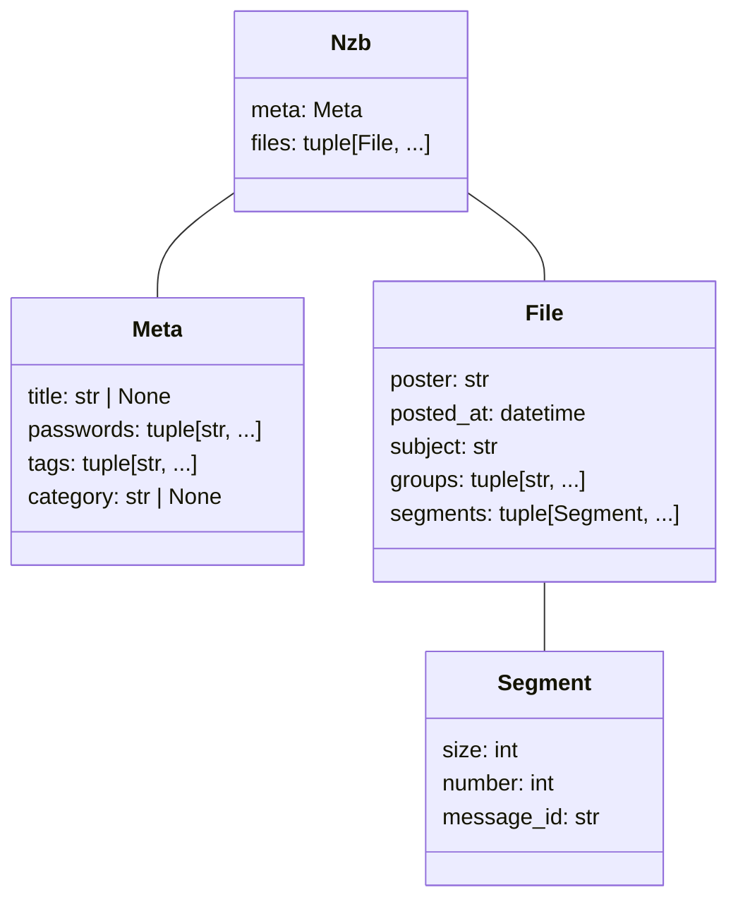

# Structure of an NZB file

## Overview

[NZB is an XML-based file format for retrieving posts from NNTP (Usenet) servers](https://en.wikipedia.org/wiki/NZB).
Here's an example file:

```xml
<?xml version="1.0" encoding="UTF-8"?>
<!DOCTYPE nzb PUBLIC "-//newzBin//DTD NZB 1.1//EN" "http://www.newzbin.com/DTD/nzb/nzb-1.1.dtd">
<nzb xmlns="http://www.newzbin.com/DTD/2003/nzb">
    <head>
        <meta type="title">Big Buck Bunny - S01E01.mkv</meta>
        <meta type="password">secret</meta>
        <meta type="tag">HD</meta>
        <meta type="category">TV</meta>
    </head>
    <file poster="John &lt;nzb@nowhere.example&gt;" date="1706440708" subject="[1/1] - &quot;Big Buck Bunny - S01E01.mkv&quot; yEnc (1/2) 1478616">
        <groups>
            <group>alt.binaries.boneless</group>
        </groups>
        <segments>
            <segment bytes="739067" number="1">9cacde4c986547369becbf97003fb2c5-9483514693959@example</segment>
            <segment bytes="739549" number="2">70a3a038ce324e618e2751e063d6a036-7285710986748@example</segment>
        </segments>
    </file>
</nzb>
```

Behind all the ugly XML, the core is pretty simple. An NZB file has optional creator-defined metadata (some of which are ["standardized"](https://sabnzbd.org/wiki/extra/nzb-spec)) and several files. 

Each file has some metadata attached to it, belongs to one or more Usenet groups, and contains one or more segments. 
Each segment has a unique message ID and its size in bytes. 
Together, the segments form a single file. 

For instance, in the example above, `file` points to a file called `Big Buck Bunny - S01E01.mkv` that belongs to the `alt.binaries.boneless` group and was broken into 2 segments, each about 739 kilobytes in size.

## Diagram

Here's a class diagram representing the structure of an NZB, which mirrors the Python implementation.

